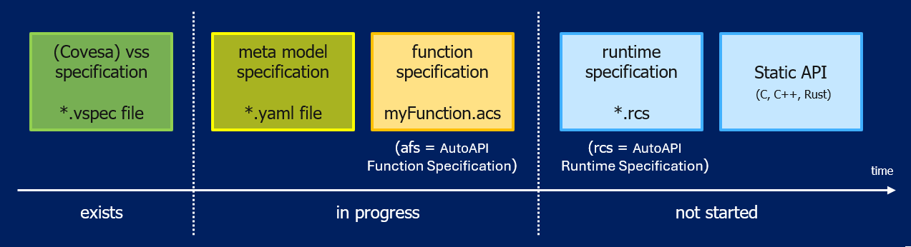

..
   # *******************************************************************************
   # Copyright (c) 2026 ZF Friedrichshafen AG
   #
   # See the NOTICE file(s) distributed with this work for additional
   # information regarding copyright ownership.
   #
   # This program and the accompanying materials are made available under the
   # terms of the Apache License Version 2.0 which is available at
   # https://www.apache.org/licenses/LICENSE-2.0
   #
   # SPDX-License-Identifier: Apache-2.0
   #
   # Contributors:
   #   Thomas Pfleiderer - Meta model added
   # *******************************************************************************

Current status of the project:

   
Component Specification File
============================  

A Component Specification File is characterized by a set of attributes and parameters. Attributes describe the signal itself (e.g., its properties and characteristics), 
while parameters provide additional configuration and implementation-specific information. Together, they define all information required for API generation and integration.

A Component Specification File always describes exactly **one** function: its ``dataInterfaces``, its ``parameters`` and the scheduling of
its own runnables. It does not describe how this function is combined with other functions, how their signals are connected to each other,
or in which order several functions execute relative to each other on a system. That system-level composition of multiple Component
Specification Files is described by the :doc:`Runtime Specification File </doc/runtime_specification/runtime_specification_file>`.

.. table::  Component: 

   +----------------+----------+----------------------------------------------------------+-----------------------------------------------------+
   | **Property /   | **Req.** | **Description**                                          | **Example / Notes**                                 |
   | Attribute**    |          |                                                          |                                                     |
   +----------------+----------+----------------------------------------------------------+-----------------------------------------------------+
   | dataInterfaces | Yes      | Collection of required signals                           | - namePath: Vehicle.Speed                           |
   |                |          |                                                          |                                                     |
   |                |          |                                                          |   direction: input                                  |
   |                |          |                                                          |                                                     |
   |                |          |                                                          |   dataType: float                                   |
   |                |          |                                                          |                                                     |
   |                |          |                                                          |   unit: km/h                                        |
   |                |          |                                                          |                                                     |
   |                |          |                                                          |   etc.                                              |
   +----------------+----------+----------------------------------------------------------+-----------------------------------------------------+
   | parameters     | Yes      | Collection of parameters for calibration & configuration | - namePath: Vehicle.Chassis.HazardRequestDurationMs |
   |                |          |                                                          |                                                     |
   |                |          |                                                          |   dataType: uint32                                  |
   |                |          |                                                          |                                                     |
   |                |          |                                                          |   defaultValue: 3000                                |
   |                |          |                                                          |                                                     |
   |                |          |                                                          |   unit: ms                                          |
   |                |          |                                                          |                                                     |
   |                |          |                                                          |   etc.                                              |
   +----------------+----------+----------------------------------------------------------+-----------------------------------------------------+
   | scheduling     | Yes      | Scheduling information for runnable/function entry point | - functionName: SpeedHazardDetection.Init           |
   |                |          | [1]_                                                     |                                                     |   
   |                |          |                                                          |   runType: init                                     |
   |                |          |                                                          |                                                     |   
   |                |          |                                                          |   cycleTimeMs: 0                                    |
   |                |          |                                                          |                                                     |   
   |                |          |                                                          |   ASIL: B                                           |
   |                |          |                                                          |                                                     |   
   |                |          |                                                          |   previousRunnableRef: System.Startup               |
   +----------------+----------+----------------------------------------------------------+-----------------------------------------------------+

.. [1] **Remark:** There may be dependencies to other functions not included in this specification file. This is allowed. The whole picture is defined in the runtime specification, see :doc:`Software Architecture </doc/runtime_specification/runtime_specification_file>`.

Component Specification File
----------------------------

Template Version 0.0.1

.. literalinclude:: autoapiframework_component_specification_template_V01.acs.yaml
   :language: yaml
   :linenos:

What needs to be added for the SpeedHazardDetection example:

.. literalinclude:: autoapiframework_component_specification_example.acs.yaml
   :language: yaml
   :linenos:

.. toctree::
   :caption: SpeedHazardDetection (single cyclic runnable)
   :maxdepth: 1

   examples/speed_hazard_detection_example
