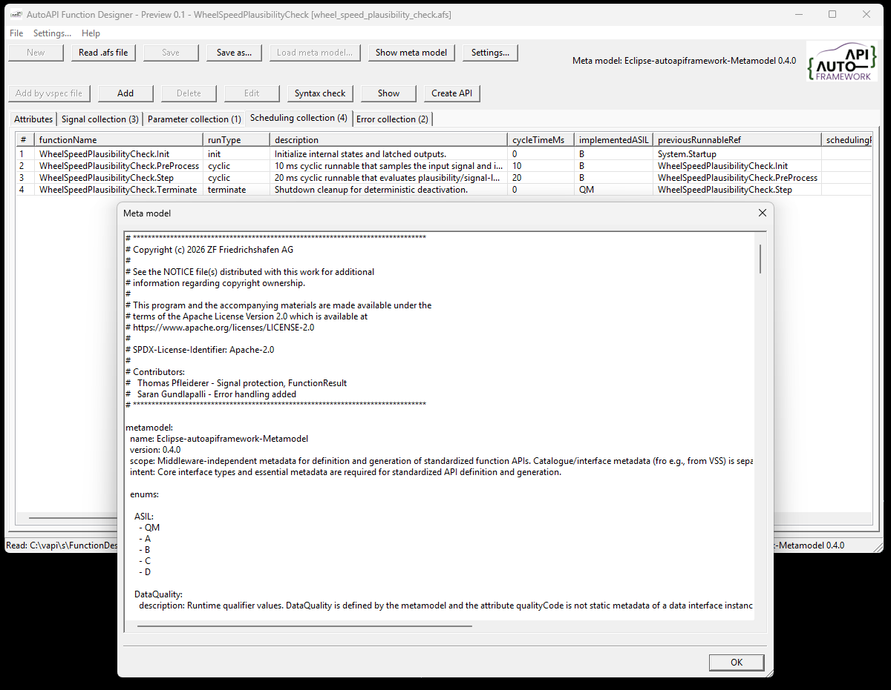
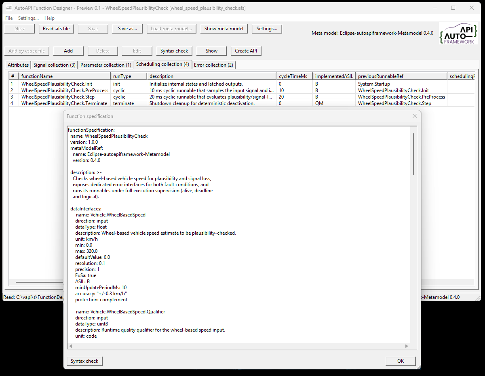
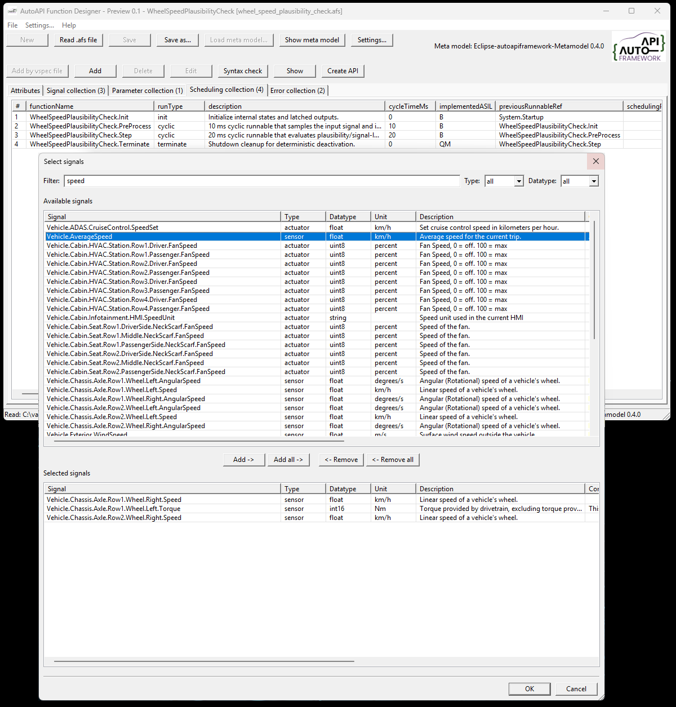
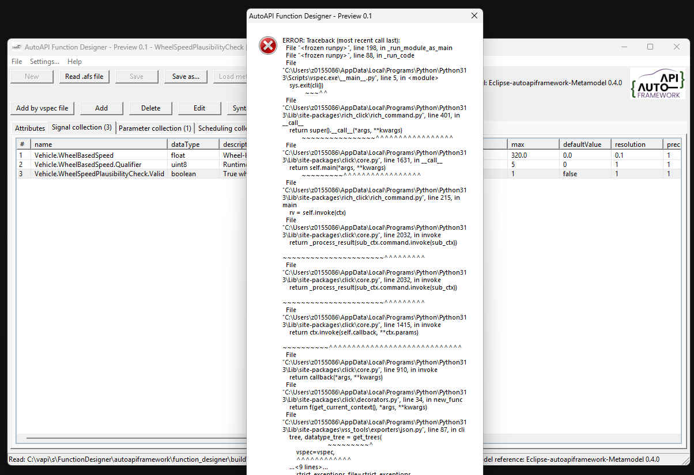

..
   # *******************************************************************************
   # Copyright (c) 2026 ZF Friedrichshafen AG
   #
   # See the NOTICE file(s) distributed with this work for additional
   # information regarding copyright ownership.
   #
   # This program and the accompanying materials are made available under the
   # terms of the Apache License Version 2.0 which is available at
   # https://www.apache.org/licenses/LICENSE-2.0
   #
   # SPDX-License-Identifier: Apache-2.0
   #
   # Contributors:
   #   Thomas Pfleiderer - Function designer added
   # *******************************************************************************

Application Purpose and Use
===========================

Function designer is an executable for viewing and editing Eclipse autoapiframework function specifications.

Purpose
-------

AutoAPI Function Designer is a desktop editor for Eclipse autoapiframework
function specifications. It provides a human-readable view of function API
metadata and preserves the YAML document structure when a specification is
written again.

The application works with two related files:

* A function specification (``.afs``), which describes one function's data
  interfaces, parameters, scheduling, and error interfaces.
* A meta model (YAML), which defines the supported interface types, properties,
  and enumerations used to interpret the function specification.

The current example meta model is
``examples/autoapiframework_metadata_V04.yaml``.

  

Main Views
----------

When an ``.afs`` file is opened, the application displays its contents in
separate views:

Attributes
   Shows the function name, version, meta-model reference, collection sizes,
   and full description.

Data interfaces
   Shows entries from ``dataInterfaces``. Columns are derived from the
   meta-model's ``Data`` interface type.

Parameters
   Shows entries from ``parameters``. Columns are derived from the
   meta-model's ``Parameter`` interface type.

Scheduling
   Shows entries from ``scheduling``. Columns are derived from the
   meta-model's ``Scheduling`` interface type, including execution
   supervision details.

Error interfaces
   Shows entries from ``errorInterfaces``. Columns are derived from the
   meta-model's ``Error`` interface type and describe function-specific
   diagnostic conditions separately from a runnable's generic execution
   result.

Properties that occur in a specification but are not defined by the meta model
are retained and displayed as additional columns. This allows newer or
project-specific metadata to remain visible during inspection.

Typical Workflow
----------------

1. Start the application. The application will load the configured meta model if it is available. If  not found it looks automatically for a file named ``autoapiframework_meta_model.yaml``.
2. Open an existing ``.afs`` file.
3. Confirm that the referenced meta-model version is supported.
4. Inspect attributes, data interfaces, parameters, scheduling, and error
   interfaces in their respective views.
5. Use **'Load meta model...'** when the meta model is not found beside the
   executable or when another compatible meta model is required. A restart of the application is required.
6. Use **'Write .afs file as...'** to save the specification under a new name.
7. Use **'Add via VSS'** to import signal information from a VSS file.
8. The **'supervision'** node needs to be edited in an external editor.

The editor keeps the parsed YAML tree in memory. When the file is written, key
order, block-style layout, folded descriptions, and quoting are preserved as
far as supported by the YAML writer.

Working with VSS Signals
------------------------

The **'Add via vss'** workflow can import signal information from a VSS file. The
application uses the ``vspec`` executable supplied by ``vss-tools`` to convert
the selected ``.vspec`` file to JSON, after which the signal can be added to
the function specification.

The official VSS repository can be cloned with:

.. code-block:: powershell

   git clone https://github.com/COVESA/vehicle_signal_specification.git

For a direct conversion, run:

.. code-block:: powershell

   vspec export json --vspec spec/Vehicle/Vehicle.vspec --output VehicleSignalSpecification.json

After pressing the **'Add via VSS'** button, you will be prompted to select a vspec file. When you select a vspec file, the included signals are displayed.

If an error message appears, you may have selected a vspec file that has dependencies on other vspec files. In this case, you need to open the root vspec file instead.

Examples
--------

The ``examples`` directory contains ready-to-use specifications, including:

* ``speed_hazard_detection.afs``
* ``vehicle_speed_fusion_multirate.afs``
* ``wheel_speed_plausibility_check.afs``

These files can be opened to explore data interfaces, parameters, scheduling,
execution supervision, and function-specific error interfaces.
