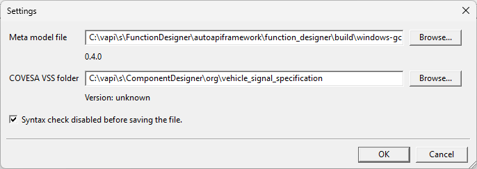
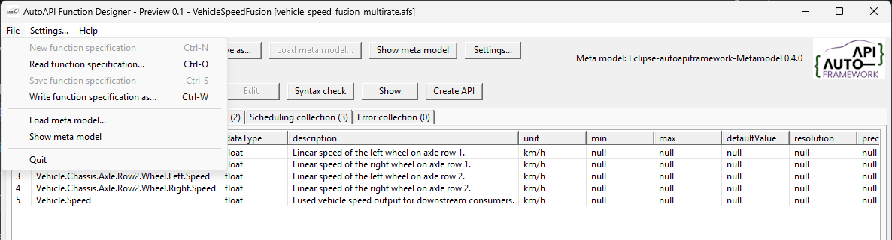
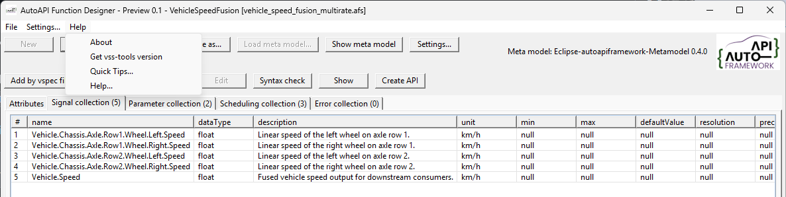

..
   # *******************************************************************************
   # Copyright (c) 2026 ZF Friedrichshafen AG
   #
   # See the NOTICE file(s) distributed with this work for additional
   # information regarding copyright ownership.
   #
   # This program and the accompanying materials are made available under the
   # terms of the Apache License Version 2.0 which is available at
   # https://www.apache.org/licenses/LICENSE-2.0
   #
   # SPDX-License-Identifier: Apache-2.0
   #
   # Contributors:
   #   Thomas Pfleiderer - Function designer added
   # *******************************************************************************

Application Purpose and Use
===========================

The Function Designer is an application for viewing and editing Eclipse autoapiframework function specifications.

.. figure:: figures/meta_model_window.png
   :alt: meta model window

Purpose
-------

The AutoAPI Function Designer is a desktop editor for Eclipse autoapiframework
function specifications. It provides a human-readable view of function API
metadata and preserves the YAML document structure when a specification is
written again.

The application works with two related files:

* A function specification (``.afs``), which describes one function's data
  interfaces, parameters, scheduling, and error interfaces.
* A meta model (YAML), which defines the supported interface types, properties,
  and enumerations used to interpret the function specification.

The current example meta model is
``examples/autoapiframework_metadata_V04.yaml``.

Main Views
----------

When you open an ``.afs`` file, the application displays its contents in
separate views:

Attributes
   Shows the function name, version, meta-model reference, collection sizes,
   and full description.

Data interfaces
   Shows entries from ``dataInterfaces``. Columns are derived from the
   meta-model's ``Data`` interface type.

Parameters
   Shows entries from ``parameters``. Columns are derived from the
   meta-model's ``Parameter`` interface type.

Scheduling
   Shows entries from ``scheduling``. Columns are derived from the
   meta-model's ``Scheduling`` interface type, including execution
   supervision details.

Error interfaces
   Shows entries from ``errorInterfaces``. Columns are derived from the
   meta-model's ``Error`` interface type and describe function-specific
   diagnostic conditions separately from a runnable's generic execution
   result.

Properties that occur in a specification but are not defined by the meta model
are retained and displayed as additional columns. This allows newer or
project-specific metadata to remain visible during inspection.

.. figure:: figures/function_specification_window.png
   :alt: function specification window   

Typical Workflow
----------------

1. Start the application. It loads the configured meta model, if available. If
   the file cannot be found, the application automatically looks for
   ``autoapiframework_meta_model.yaml``.
2. Open an existing ``.afs`` file.
3. Confirm that the referenced meta-model version is supported.
4. Inspect attributes, data interfaces, parameters, scheduling, and error
   interfaces in their respective views.
5. Use **'Load meta model...'** if the meta model is not found in the same
   directory as the executable, or if you need to load a different compatible
   meta model. You must restart the application for the change to take effect.
6. Use **'Write .afs file as...'** to save the specification under a new name.
7. Use **'Add via VSS'** to import signal information from a VSS file.

The editor keeps the parsed YAML tree in memory. When the file is written, key
order, block-style layout, folded descriptions, and quoting are preserved as
far as supported by the YAML writer.

  
Limitations
-----------

The 'Create API' functionality is still under development. 

.. tip::

   To create a valid  specification file, you must carefully review the meta model 
   specification. The syntax check will help identify obvious errors, but it 
   cannot guarantee full compliance with the meta model.   

Working with VSS Signals
------------------------

The **'Add via VSS'** workflow imports signal information from a VSS file. The
application uses the ``vspec`` executable provided by ``vss-tools`` to convert
the selected ``.vspec`` file to JSON, after which the signal can be added to
the function specification.

The official VSS repository can be cloned with:

.. code-block:: powershell

   git clone https://github.com/COVESA/vehicle_signal_specification.git

For a direct conversion, run:

.. code-block:: powershell

   vspec export json --vspec spec/Vehicle/Vehicle.vspec --output VehicleSignalSpecification.json

.. figure:: figures/signal_selection_window.png
   :alt: signal selection window  

After you click **'Add via VSS'**, you are prompted to select a VSS file. The
signals it contains are then displayed.

If an error message appears, the selected VSS file may depend on other VSS
files. In this case, open the root VSS file instead.

.. figure:: figures/error_opening_vspec_file.png
   :alt: error opening VSS file window  

Examples
--------

The ``examples`` directory contains ready-to-use specifications, including:

* ``speed_hazard_detection.afs``
* ``vehicle_speed_fusion_multirate.afs``
* ``wheel_speed_plausibility_check.afs``

These files can be opened to explore data interfaces, parameters, scheduling,
execution supervision, and function-specific error interfaces.

Application Menu Overview
-------------------------

The Function Designer provides an interface for creating and managing function
specifications. It requires a meta model file in the same directory as the
executable to operate correctly. If you change this setting, restart the
application for the change to take effect.

If you select the root directory of a cloned VSS/VSpec repository, the Function
Designer can automatically retrieve version information from it.

.. tip::

   The application checks the syntax before saving the specification. To skip
   this check, disable it in the settings.

The File menu contains the main file-related commands.

In addition to the help documentation, the application can check whether the
COVESA tools are installed correctly. This information can help with
troubleshooting and verifying that all required dependencies are available.

The **Quick Tips** section provides additional guidance.
