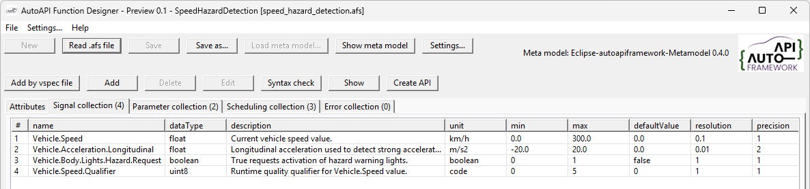
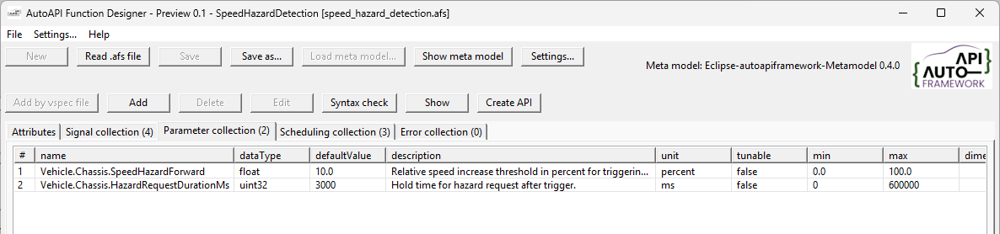
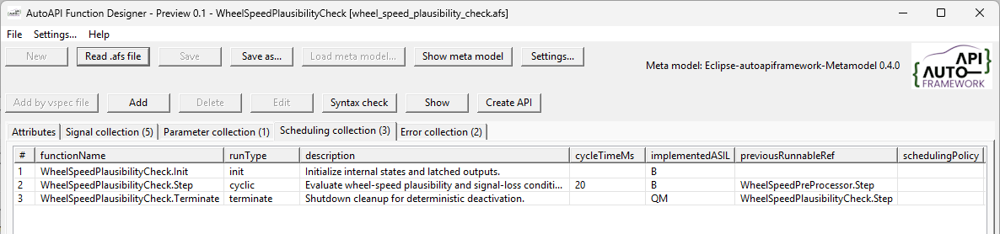
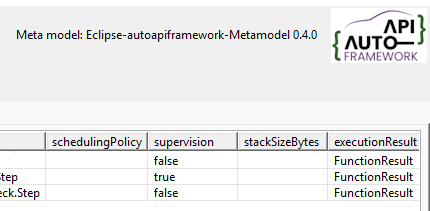
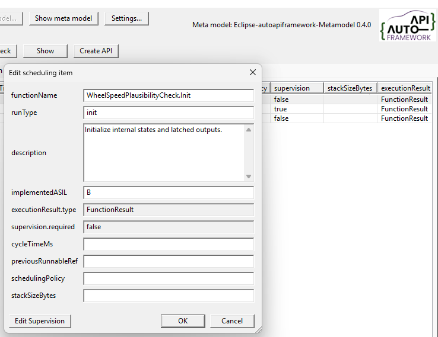
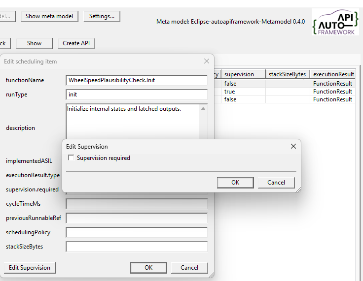
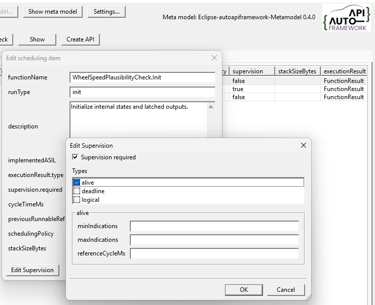
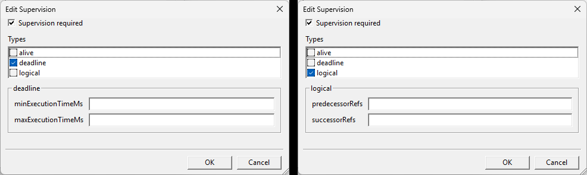
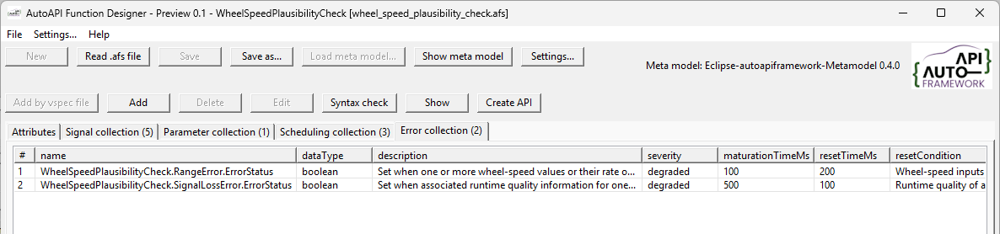

..
   # *******************************************************************************
   # Copyright (c) 2026 ZF Friedrichshafen AG
   #
   # See the NOTICE file(s) distributed with this work for additional
   # information regarding copyright ownership.
   #
   # This program and the accompanying materials are made available under the
   # terms of the Apache License Version 2.0 which is available at
   # https://www.apache.org/licenses/LICENSE-2.0
   #
   # SPDX-License-Identifier: Apache-2.0
   #
   # Contributors:
   #   Thomas Pfleiderer - Function designer added
   # *******************************************************************************

Function Specification Authoring
================================

The Function Designer edits a Function Specification (``.afs``) against a
loaded Meta Model. Use the guidance below when creating or reviewing its
collections. For the complete property definitions, see the
:doc:`Meta Model reference </doc/meta_model/meta_model>` and
:doc:`Function Specification File reference </doc/function_specification/function_specification_file>`.

Signal Collection
-----------------

Add one entry to ``dataInterfaces`` for each data interface the function
consumes or produces. Set ``direction`` relative to the function: ``input``
means the function consumes the value, and ``output`` means it produces it.
Use the canonical VSS name and preserve the signal's established meaning and
datatype; do not redefine catalogue semantics for a particular function.

Describe the interface contract, including its unit, range, default,
resolution, precision, update period, accuracy, safety classification, and
protection requirement. Use ``null`` where a numeric value is not defined or
applicable. Keep runtime quality separate from static signal metadata, as
described in the Function Specification reference.

Parameter Collection
--------------------

Add function configuration and calibration values to ``parameters`` rather
than representing them as ordinary data interfaces. Reuse canonical
catalogue identifiers where available, and describe each parameter's type,
default, unit, tunability, and applicable limits. Add ``dimensions`` when the
parameter is an array or map; omit it for scalars.

Scheduling Collection
---------------------

Add one entry to ``scheduling`` for each independently scheduled runnable.
Use the ``<FunctionName>.Init``, ``<FunctionName>.Step``, and
``<FunctionName>.Terminate`` naming convention where those lifecycle stages
apply. Select the appropriate ``runType``; provide ``cycleTimeMs`` for cyclic
runnables, and omit it for other run types. Explain the runnable's purpose in
``description`` and set its ``implementedASIL``.

Use ``previousRunnableRef`` only when an explicit ordering constraint exists;
it does not mean that the referenced runnable must execute immediately before
this one. Each entry also declares its generic execution result as
``executionResult: {type: FunctionResult}``. The ``supervision`` object is
required for every runnable; its configuration is covered in the
Supervision section below.

Supervision
-----------

The supervision functionality allows you to monitor the execution of the function 
and detect any anomalies or errors. In the collection view it is shown as ``true`` 
or ``false`` meaning ``required`` or ``not required``.

It can be enabled or disabled for each function, allowing you to control which 
functions are actively supervised during execution. To do this, open the ``Edit`` dialog,
there is a ``Edit Supervision`` button to configure the supervision settings.

If not required, the nodes are not available for editing.

When supervision is required, select one or more supervision types. Each type
has its own configuration fields:

1. Alive Supervision
~~~~~~~~~~~~~~~~~~~~

  Question answered:
  "Is the runnable still running periodically?"

Checks whether a function is executed the expected number of times within a monitoring interval.

Typical use:

- Cyclic tasks
- Periodic sensor processing
- Communication handlers

2. Deadline Supervision
~~~~~~~~~~~~~~~~~~~~~~~

  Question answered:
  "Was the function completed within the expected time?"

Checks whether the execution time between two checkpoints is within configured limits.

Typical use:

- Detect deadlocks
- Detect long loops
- Detect performance issues

3. Logical Supervision
~~~~~~~~~~~~~~~~~~~~~~

  Question answered:
  "Did the software follow the correct execution flow?"

Checks whether checkpoints are reached in the correct sequence.

Typical use:

- State machines
- Safety-critical control flows
- Initialization sequences

Only the settings for selected types are available for editing and written to
the specification. If no type is selected, the supervision configuration
contains no type-specific settings.

**alive:** set the minimum and maximum number of indications and the reference cycle in milliseconds.

**deadline:** set the minimum and maximum execution time in milliseconds.

**logical:** list the predecessor and successor references used for logical supervision. Enter multiple references as a comma-separated list.

.. list-table:: Summary
   :header-rows: 1
   :widths: 30 70

   * - Supervision Type
     - Checks
   * - Alive
     - Function runs the expected number of times
   * - Deadline
     - Function finishes within the allowed time
   * - Logical
     - Function follows the correct sequence of execution

Error Collection
-----------------

Use ``errorInterfaces`` for function-specific diagnostic conditions when
they are needed. Keep these distinct from ``FunctionResult``, which reports
the generic outcome of execution, and from runtime transport or adapter
failures. The Error interface is a candidate concept; see the Function
Specification reference for its current status and modeling guidance.

