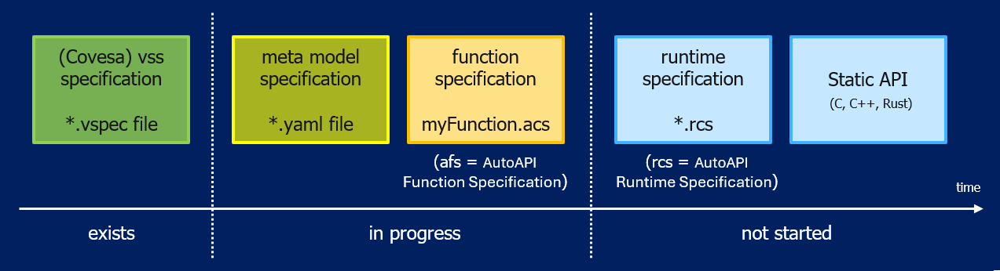

..
   # *******************************************************************************
   # Copyright (c) 2026 ZF Friedrichshafen AG
   #
   # See the NOTICE file(s) distributed with this work for additional
   # information regarding copyright ownership.
   #
   # This program and the accompanying materials are made available under the
   # terms of the Apache License Version 2.0 which is available at
   # https://www.apache.org/licenses/LICENSE-2.0
   #
   # SPDX-License-Identifier: Apache-2.0
   #
   # Contributors:
   #   Thomas Pfleiderer - Meta model added
   #   Saran Gundlapalli - function_specification_file.rst updated according to metamodel v0.4.0
   # *******************************************************************************

Current status of the project:

   
Function Specification File
===========================  

A Function Specification File describes a single function and how that function uses the interface concepts defined by the metamodel. It contains function-specific configuration information, such as interface direction, protection requirements, parameters, scheduling, and supervision. It should not evolve into a second semantic catalogue.

Catalogue/interface metadata, function-specific configuration, and runtime information shall remain clearly separated:

- **Catalogue/interface semantics:** canonical VSS signals and parameters, or approved extensions, that define the meaning of data and parameters.
- **Function-specific configuration:** how a specific function uses those interfaces, including input/output direction, protection requirements, scheduling, and the selected supervision mechanisms.
- **Runtime information:** actual runtime values and status information, such as data quality, ``FunctionResult``, transport or runtime failures, and function-specific diagnostic status.

The Function Specification should primarily reference and reuse catalogue-defined semantics rather than redefining the same metadata independently. If metadata must be included directly in the Function Specification for code generation or tooling purposes, it shall remain clear which information originates from the catalogue and which information belongs to function-specific configuration.

A Function Specification File describes exactly **one** function. It does not define the system-level composition of multiple functions. Dependencies on runnables from other functions may be referenced; however, the complete composition is defined in the :doc:`Runtime Specification File </doc/runtime_specification/runtime_specification_file>`.

About the naming
----------------

In our documentation, we deliberately use the term Function (for example, Function Specification File and Function Adapter) because alternative terms, such as Component, Application, or Module, often carry established meanings in different frameworks and toolchains.

In this context, a Function represents a self-contained unit of functionality that encapsulates application or algorithmic logic (for example, MATLAB-generated code) and exposes it through a middleware-independent interface. Where required, a wrapper or adapter may be used to connect this logic to the underlying middleware or runtime environment. The term is intentionally generic and can be used to describe a wide range of functional implementations, including:

- Vehicle Function
- Diagnostic Function 
- Control Function 
- Analysis Function 
- Calculation Function 
- Signal Processing
- Data Processing 
- Estimation Function 
- Monitoring Function 
- Simulation Function 

Therefore, the term Function should be understood as a generic abstraction for algorithmic functionality rather than as a specific software architectural concept.

Catalogue and VSS reuse
-----------------------

Existing VSS nodes shall be reused whenever their semantics match the required interface. New ``Vehicle.*`` paths shall only be introduced when no suitable VSS node exists. Such additions shall be explicitly identified as approved extensions and shall not be presented as standard VSS catalogue entries.

Parameter identifiers shall follow the same VSS-style hierarchical naming convention as all other catalogue interfaces. Existing catalogue entries shall be reused whenever available. If no suitable entry exists, the parameter shall be introduced as an explicitly approved extension within the relevant ``Vehicle.<Domain>...`` semantic branch rather than under a standalone function-specific namespace.

Content Of Function Specification File
--------------------------------------

The metamodel defines mandatory properties *within*  the interface types. However, it does not currently define collection-level cardinalities for every Function Specification File. Therefore, the presence of collections described below is provided as guidance rather than as a metamodel requirement.

.. list-table:: Function Specification content
   :header-rows: 1
   :widths: 20 15 35 30

   * - Property / Attribute
     - Presence
     - Description
     - Example / Notes
   * - ``dataInterfaces``
     - As needed
     - Data interfaces used by the function. Reuse canonical VSS/catalogue semantics where available.
     - ``name: Vehicle.Speed``; ``direction: input``; ``dataType: float``
   * - ``parameters``
     - As needed
     - Calibration/configuration values identified through VSS-style catalogue or approved extension paths.
     - ``name: Vehicle.Chassis.HazardRequestDurationMs``; ``dataType: uint32``
   * - ``errorInterfaces``
     - Optional / candidate
     - Candidate function-specific diagnostic interfaces, separate from generic ``FunctionResult``.
     - ``name: <Function>.<ErrorName>.ErrorStatus``; ``severity: degraded``
   * - ``scheduling``
     - As needed
     - Runnable lifecycle, activation, timing and execution contract.
     - ``functionName: SpeedHazardDetection.Step``; ``runType: cyclic``; ``cycleTimeMs: 20``; ``implementedASIL: B``
   * - ``scheduling[].supervision``
     - Inside scheduling
     - Per-runnable execution supervision. ``required`` is always present; type-specific configuration is included only when supervision is required.
     - ``required: true``; ``type: [alive, deadline]``

Scheduling notes
----------------

``cycleTimeMs`` is only applicable to ``runType: cyclic`` and shall be omitted for ``init``, ``event`` and ``terminate`` unless the metamodel is explicitly changed.

``previousRunnableRef`` is optional. It references a runnable that must precede the current runnable when an explicit ordering constraint exists. It does not mean that the referenced runnable must execute immediately before the current runnable.

Runnable names follow the current metamodel convention ``<FunctionName>.Init``, ``<FunctionName>.Step`` and ``<FunctionName>.Terminate``. If preprocessing is independently scheduled, it shall be represented as a separate function/runnable, for example ``WheelSpeedPreProcessor.Step``, and referenced through ``previousRunnableRef`` and/or logical supervision.

Runtime quality
---------------

Runtime quality is associated with a Data interface and shall be indicated explicitly in the Function Specification as a runtime companion interface. For example, ``Vehicle.Speed.Qualifier`` is identified as an enum-based runtime signal using ``DataQuality``. It is not modeled as a normal Data interface and therefore does not repeat static Data properties such as min, max, defaultValue, resolution or precision. The qualifier remains associated with its parent Data interface through ``runtimeCompanion.qualityCode``.

FunctionResult and Error
------------------------

``FunctionResult`` describes the generic runtime execution outcome contract. A static Function Specification shall therefore describe the result type rather than hard-code a value such as ``executionResult: success``. The runtime instance carries ``success``, ``failure`` or ``notAvailable``.

``errorInterfaces`` represents the **candidate/provisional** Error concept and remains subject to partner alignment/review within Eclipe and Shift2SdV projects and may evolve based on feedback. Example values for severity, maturation, dependencies, fallback behavior and safety reactions shall be requirement-based or explicitly identified as illustrative.

Template Version 0.0.1

.. literalinclude:: autoapiframework_function_specification_template_V01.afs.yaml
   :language: yaml
   :linenos:

What needs to be added for the SpeedHazardDetection example:

.. literalinclude:: autoapiframework_function_specification_example.afs.yaml
   :language: yaml
   :linenos:

