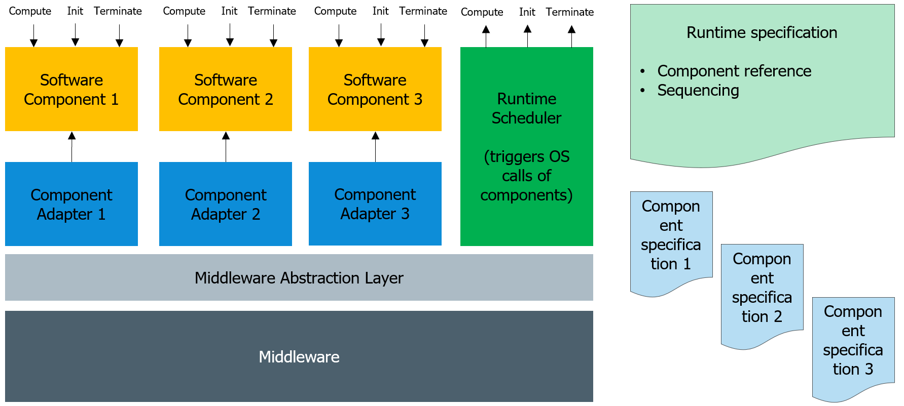

..
   # *******************************************************************************
   # Copyright (c) 2026 Contributors to the Eclipse Foundation
   #
   # See the NOTICE file(s) distributed with this work for additional
   # information regarding copyright ownership.
   #
   # This program and the accompanying materials are made available under the
   # terms of the Apache License Version 2.0 which is available at
   # https://www.apache.org/licenses/LICENSE-2.0
   #
   # SPDX-License-Identifier: Apache-2.0
   #
   # Contributors:
   #   Thomas Pfleiderer - Meta model added
   # *******************************************************************************

   
Software Architecture
=====================

Runtime Specification File
--------------------------

Describe the runtime specification file

