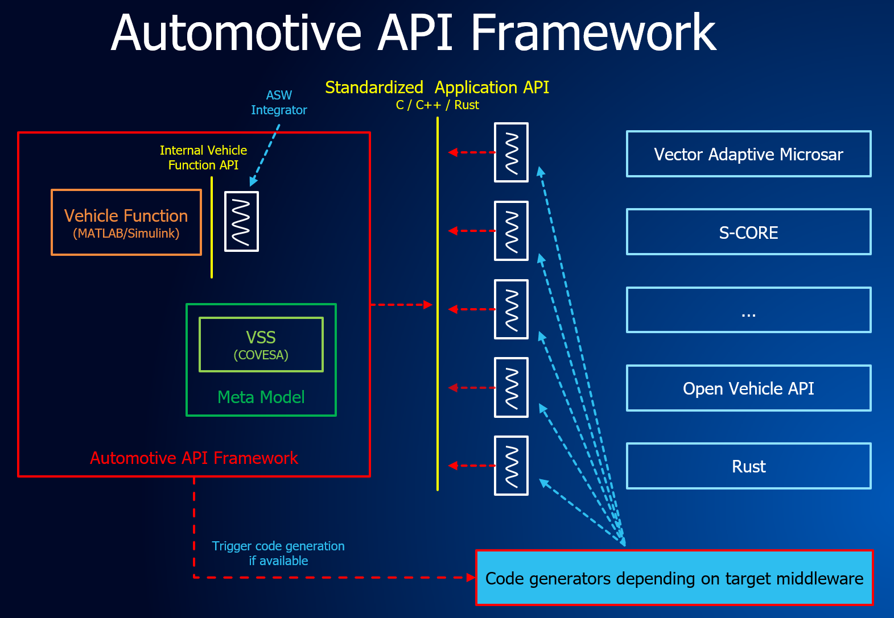

..
   # *******************************************************************************
   # Copyright (c) 2024 Contributors to the Eclipse Foundation
   #
   # See the NOTICE file(s) distributed with this work for additional
   # information regarding copyright ownership.
   #
   # This program and the accompanying materials are made available under the
   # terms of the Apache License Version 2.0 which is available at
   # https://www.apache.org/licenses/LICENSE-2.0
   #
   # SPDX-License-Identifier: Apache-2.0
   #
   # Contributors:
   #   Thomas Pfleiderer - first documentation
   # *******************************************************************************

**Background**

Developing automotive applications for microprocessor-based HPCs is challenging because application code from conventional systems is often tightly coupled to the middleware and operating system. Low‑level middleware APIs add complexity, requiring developers to write and maintain extensive boilerplate for integration and testing, while also demanding deep automotive-specific knowledge of the HPC software stack.
 
**Scope**

The Eclipse Automotive API Framework decouples application logic from the middleware stack and operating system in automotive HPC systems by providing an application-facing interface and defining the accompanying workflow.

Standardized Application API
============================

**How the Application Software Developer Meets the Middleware Integrator: Through a Standardized API**

.. figure:: figures/mapping_asw_function.png
   :alt: mapping asw function

We aim to introduce a standardized application API that also incorporates safety‑relevant aspects. Such an API enables a clear separation between the vehicle‑function developer (or vehicle‑function integrator) and the underlying middleware. 
This approach creates platform independence while maintaining safety guarantees.

With a standardized application API, application code remains stable. Only the generated middleware glue code changes per platform.

This separation ensures:

- the application remains untouched and re-certifiable
- platform‑specific safety mechanisms are handled reliably by the generator

For testing and demonstration purposes, the vehicle function could, for example, run on top of the open‑source project ``Eclipse Open Vehicle API``, while later the same function would operate on the target middleware without requiring changes to the application logic.

Collaboration wanted
====================

We are currently working on defining a safety compliant C++ application interface intended for ASIL B (maybe even up to to ASIL D) capable vehicle functions. 

The goal is to create a middleware independent API that ensures deterministic behavior, robust error propagation and strict memory safety guarantees in line with ISO 26262. 
This includes defining safe state transitions, fault containment boundaries, end to end communication integrity, and standardized diagnostic reporting for safety critical services. 

The overarching objective is to enable developers to implement ASIL relevant vehicle logic without coupling it tightly to specific middleware frameworks or transport layers. 

We are seeking for collaboration partners interested in discussing architectural concepts, validating safety mechanisms and contributing to enhancements aligned with Covesa—especially around portable service definitions, API safety extensions, and cross platform execution models.

.. raw:: html

      

Auto Code Generation
====================

For a standardized API each middleware can implement code generators which can be called by the ``Eclipse Autoapiframework``.

For a standardized application API, it becomes possible to generate code automatically for the target middleware. These code generators are part of the target‑middleware implementation and will not be included in the ``Eclipse Autoapiframework``.

Why are auto code generators important?

1. Reduced Human Error
2. 
Manually writing middleware‑integration code is error‑prone.
A code generator creates the same logic consistently and deterministically, which eliminates:

- typos
- incorrect API usage
- inconsistent patterns
- forgotten safety checks

Less manual coding → fewer systematic errors.

2. Enforced Safety Patterns

Code generators can embed proven safety concepts, such as:

- safe state handling
- range checks and input validation
- timing and deadline monitoring hooks
- memory‑access restrictions
- exception/path handling patterns required for ASIL levels

This ensures every generated component has the same safety mechanisms built‑in—no developer forgets to implement them.

1. Traceability and Compliance with ISO 26262

- traceability from requirements → design → code
- reproducible builds
- evidence of systematic‑error prevention

A generator allows:

- automatic tracing from API model → generated code
- formally verified generation rules
- consistent output across versions
- compliance documentation for the generator itself

This reduces certification effort for each project.

4. Faster, Safer Updates and Refactoring
   
When middleware or safety requirements change, the generator can be updated once—and then regenerate safe conformant code for all applications. No risk of missing updates in manual code.

5. Improved Testability, generated code is:

- structurally predictable
- easier to analyze automatically
- easier to unit‑test (same patterns everywhere)
- easier to integrate with static analysis tools

Predictable structure = better tool support = fewer safety defects.

``Eclipse Autoapiframework`` can play a major rule on this.

.. raw:: html

      

Eclipse Open Vehicle API
========================

.. figure:: figures/Open_Vehicle_API_v1_white_cropped.jpg
   :alt: Open vehicle API

For demonstration purposes we will use the open-source project ``Eclipse Open Vehicle API`` as an example of middleware. 
It is a modular, component‑based C++ framework that provides a scalable and platform‑abstracted vehicle software architecture. The communication between the components uses interfaces, so its ideally for demonstrating the ``Eclipse Autoapiframework``.

Right now, there is no code generator available. Later such code generator will be in the project itself rather than here in the ``Eclipse Autoapiframework``.

The Eclipse Open Vehicle API contains tools and a runtime to create a vehicle abstraction interface for signal- and event-driven functions. 

- Component-based
- Transfer existing signal-based ECUs to HPC
- Implement new signal- and event-based vehicle functions
- Vehicle independent implementation (vehicle abstraction)
- Multi-vendor – open for play-store approach
- Standardized interface for functions
- Automate as much as possible – reduce coding
- Allow HIL and SIL
- Safety aspects for use with chassis and ADAS functions

Documentation: `Open Vehicle API <https://eclipse.dev/openvehicle-api/>`_

On GitHub: `Eclipse Open Vehicle API <https://github.com/eclipse-openvehicle-api>`_

